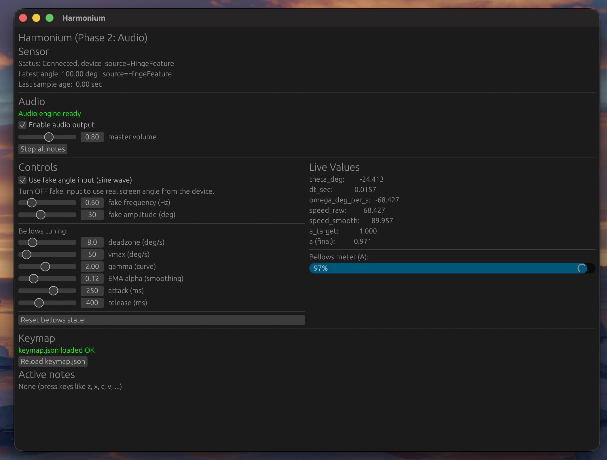

# Harmonium-in-Mac 🎶

A desktop app that turns **screen-angle movement** into **harmonium bellows pressure**.

This project uses my own Rust crate  
👉 **booklid-rust**: https://github.com/chintan-27/booklid-rust  
to read real-time **screen hinge angle** and convert it into expressive musical control.

---

## Screenshot

> Replace the image filename with your own.



---

## What this project is

A real harmonium has two independent parts:

1. **Keys** → decide *which notes* are active  
2. **Bellows** → decide *how loud* those notes are  

This app recreates that idea digitally:

- **Keyboard keys** (`z`, `x`, `c`, etc.) act as harmonium keys
- **Laptop screen movement** acts as the bellows
- Audio samples loop continuously and their **volume is controlled by screen motion**

So you don’t “press harder” —  
you **move the screen to breathe life into the sound**.

---

## Core dependency: `booklid-rust`

This project relies on my Rust library:

🔗 **booklid-rust**  
https://github.com/chintan-27/booklid-rust

### What `booklid-rust` does
- Provides an async API to read **screen hinge angle**
- Streams angle updates at a configurable frequency
- Exposes:
  - `angle_deg`
  - sensor source metadata

In this app:
- The **change in angle over time** is interpreted as bellows pumping
- Faster movement = more air = louder sound

---

## How the bellows math works (high-level)

1. Read screen angle θ (degrees)
2. Compute angular velocity:
```

ω = (θ_now - θ_prev) / dt

```
3. Use absolute value (direction doesn’t matter)
4. Smooth the signal (EMA)
5. Apply deadzone + curve
6. Apply attack/release envelope
7. Result = **bellows amplitude A (0..1)**

Final audio volume:

```

volume = A × master_volume

```

---

## Project structure

```

src/
main.rs     # App bootstrap + sensor thread
app.rs      # GUI + orchestration
sensor.rs   # booklid-rust integration (background thread)
bellows.rs  # angle → bellows amplitude math
keymap.rs   # keyboard → note mapping
audio.rs    # looping sample-based audio engine

````

---

## Requirements

- **Rust (stable)**  
  Install via https://rustup.rs/

- **Compatible hardware / setup for `booklid-rust`**  
  (see the `booklid-rust` repository for details)

---

## Running the app

```bash
cargo run
````

---

## Key mapping (`keymap.json`)

The app expects a `keymap.json` file in the project root.

Example:

```json
{
  "z": "c2",
  "s": "c#2",
  "x": "d2",
  "d": "d#2",
  "c": "e2"
}
```

Each key maps to a **note name**, which must match an audio filename.

---

## Audio samples (`harmonium-sounds/`)

Put your harmonium samples here:

```
harmonium-sounds/
```

File naming rules:

```
c2.wav
c#2.wav
d2.wav
...
```

Supported formats:

* `.wav`
* `.mp3`
* `.ogg`
* `.flac`

Samples are **looped infinitely**, and volume is controlled by bellows amplitude.

---

## Controls

### Input mode

* **Use fake angle input** → sine wave (for testing)
* **Fake OFF** → real screen angle via `booklid-rust`

### Bellows parameters

* Deadzone (ignore jitter)
* Vmax (full air speed)
* Gamma (expressiveness curve)
* EMA smoothing
* Attack / Release times

### Audio

* Enable / disable audio
* Master volume
* Stop all notes (panic)

---

## Why this project exists

This is an experiment in:

* expressive physical interaction
* musical control without velocity keys
* Rust + real-time UI + audio
* turning hardware motion into sound

It’s intentionally playful and exploratory.

---

## Credits

* **booklid-rust** – screen angle streaming
  [https://github.com/chintan-27/booklid-rust](https://github.com/chintan-27/booklid-rust)
* **egui / eframe** – GUI
* **rodio** – audio playback and mixing

---

## License

MIT
